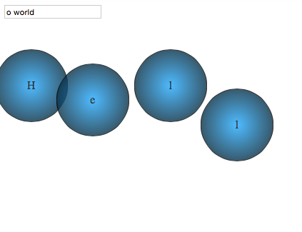

# Lettered circles

The preview: http://jsfiddle.net/5555482/2h8xfyg2/4/show/



###Task

User stories:

```
As a User I can click on the page and a circle is appears under the mouse cursor (and persists statically in that position).

As a User I can see typeable area on the page and type there.

As a User I can click on the page and every my click delete the first letter from the typeable area, and display it within the newly created circle.

